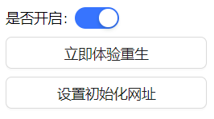

# Redemption

如果你因为一些原因超过14天没有启动你的浏览器，之后再次打开浏览器时会自动清空你的浏览器历史记录。防止你的浏览器历史记录被曝光

并且在清空历史记录后可以选择加入哪些网址到重置后的历史记录中

- 是否开启：是否开启插件的功能（默认关闭，关闭时上述功能不生效）
- 立即体验重生：点击后立即清除历史记录并注入设置好的网址
- 设置初始化网址：跳转到添加网址页面，该页面添加的网址会在重置后注入到浏览器历史记录中
